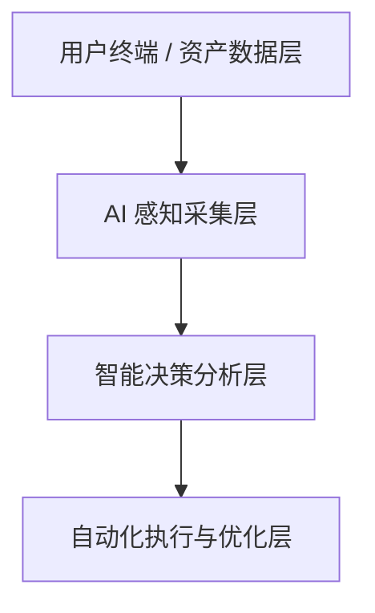

# DOC-00：IntelliServe IT Suite 解决方案概述

> **版本**：v1.0  
> **最后更新**：2026-06-11  
> **状态**：初稿  
> **依赖**：无（原始方案文档）

---

## 概述

本方案将传统桌面运维、资产管理、网络支持全流程与 AI 技术深度融合，面向 2000-5000 台终端的大型园区场景，打造 **”主动预防 - 智能响应 - 自动修复 - 持续优化”** 的闭环运维体系，解决人工响应慢、故障定位难、资产管控粗、运维效率低的痛点。
一、方案核心定位与架构
1. 核心价值
降本：减少人工重复性工作，降低故障修复时长与运维人力成本
提效：实现 70% 以上常见故障自动化处理，用户自助解决率提升
可控：资产全生命周期可视化管控，成本与合规风险提前预警
可扩展：多 VLAN Proxy 分区架构，适配 2000-5000 台终端大型园区，支持后续迭代升级
2. 整体架构（感知 - 决策 - 执行闭环）

- **感知层**：终端监控、资产台账、日志数据、用户工单全量采集
- **决策层**：AI 大模型 + 机器学习，实现故障诊断、风险预警、资源调度
- **执行层**：自动化脚本 + 自助工具，完成修复、配置、盘点、合规管控
- **优化层**：持续学习运维数据，迭代规则与模型，提升整体效率
（一）AI 驱动 IT 资产全生命周期管理

围绕 **“入库验收、台账登记、维修报废、预算管控”** 等核心业务需求，实现资产从采购到处置的全流程智能化管控。
智能入库与台账自动化
利用 OCR+AI 识别设备 SN 码、采购单据，自动录入资产台账，减少人工录入错误率
关联采购订单、保修信息，自动更新设备状态、保修到期日，无需人工维护
资产健康度预测与维护预警
采集设备 CPU、磁盘、温度、开机时长等数据，训练故障预测模型，提前预警硬盘故障、电池老化等问题
自动推送预防性维护工单，避免突发故障影响办公，实现从 “事后维修” 到 “事前预防”
闲置资产智能识别与盘活
AI 分析设备使用频率、在线时长，自动识别闲置 / 低利用率设备，推荐调配方案
结合设备折旧率、市场残值数据，生成最优报废 / 换新建议，辅助预算管控决策
自动化盘点与合规审计
定期自动扫描内网设备，与台账数据比对，生成账实差异报告，无需人工现场盘点
自动核查软件授权、合规使用情况，识别盗版 / 违规软件，生成合规报告
（二）AI 桌面运维智能支持体系

结合 **“桌面运维支持、软件管理、故障处理”** 等典型服务需求，打造 “用户自助 + AI 坐席 + 自动化修复” 三级响应体系。
AI 智能自助服务台（用户端）
基于企业微信 / 钉钉搭建对话式 AI 助手，用户输入问题（如 “电脑连不上网”“Office 报错”），自动匹配解决方案
支持文本 + 截图识别，AI 解析报错信息、系统界面，引导用户自助排查或自动推送修复工具
AI 故障智能诊断与分级处理
终端采集系统日志、错误代码、硬件状态数据，AI 快速定位故障根因，匹配知识库解决方案
分级处理：
L1 级（简单故障）：自动执行修复脚本（如重置网络、修复 Office 组件、清理缓存），无需人工介入
L2 级（复杂故障）：生成故障诊断报告，推送运维工程师，附推荐处理方案与优先级
系统与软件全流程自动化管理
统一镜像制作：AI 分析不同部门使用习惯，推荐最优系统配置，制作标准化镜像，批量部署效率提升
软件管理自动化：自动检测版本更新、授权有效期，批量推送更新，管控软件安装权限，自动卸载违规软件
外设故障智能处理：识别打印机、U 盘等外设故障，自动匹配驱动、重置服务，常见外设问题自动化解决
多线程运维任务智能调度
AI 根据故障紧急程度、工程师技能标签、工作负载，自动分配工单，优化运维资源配置
同时处理多用户故障，优先保障业务关键岗位设备，减少等待时间
（三）基础网络运维 AI 增强方案

针对 **“网络连通性排查、IP 配置、设备维护”** 等基础网络运维需求，实现网络故障快速定位与稳定保障。
网络状态实时监控与异常预警
持续监控网络设备状态、带宽使用、丢包率，AI 识别异常波动（如 ARP 攻击、带宽异常占用），提前预警
自动生成网络拓扑图，可视化设备连接状态，故障时高亮异常节点，快速定位问题设备 / 线路
IP 与网络配置自动化管理
AI 统一规划内网 IP 段，自动分配 IP 并绑定设备，减少 IP 冲突问题
终端网络故障时，自动排查 IP 配置、DNS 设置、网关状态，一键重置网络配置，恢复连通性
网络设备维护自动化
定期巡检交换机、路由器、AP 等设备，自动备份配置文件，检测固件版本更新，推荐维护窗口
会议室等重点区域网络负载预测，提前调度资源，避免重要会议期间网络拥堵
（四）运维管理规范与效率持续优化

面向 **“输出管理规范、优化资产利用率与运维效率”** 等全局提升需求，实现运维体系的持续迭代升级。
AI 驱动运维知识库自动迭代
记录所有故障处理案例、解决方案，AI 自动分类、提炼，更新知识库，优化自助服务台问答匹配度
定期分析高频故障，输出运维优化建议（如某型号设备故障率高，推荐后续采购替代方案）
运维效率量化分析与优化
统计工单处理时长、故障类型分布、资产利用率等数据，生成可视化报表
AI 分析运维流程瓶颈，推荐优化方案（如简化某类故障处理流程、调整运维排班）
IT 成本智能管控
结合资产折旧、维修成本、使用年限，预测年度 IT 运维支出，生成预算建议
识别不必要的软件授权、低效设备，推荐成本优化方案，降低整体 IT 支出
三、落地实施路径（低成本快速上线）
阶段 1：基础搭建（1-2 周）
梳理现有资产台账、运维流程、常见故障知识库
部署轻量终端监控工具 + 百炼 DeepSeek-V4 API（后续可切换 DeepSeek-V4 私有化模型），搭建基础数据采集与分析能力
搭建企业微信 / 钉钉 AI 自助助手，导入高频故障解决方案，实现基础自助服务
阶段 2：核心场景落地（2-4 周）
开发自动化修复脚本，对接终端监控，实现常见故障（网络重置、Office 修复、缓存清理）自动处理
上线资产健康度监控与基础预测功能，实现故障提前预警
完善网络监控与拓扑可视化，提升网络故障定位效率
阶段 3：优化迭代（持续）
持续采集运维数据，优化 AI 模型，提升故障诊断准确率与自动化处理率
扩展 AI 功能，实现更多复杂场景自动化，如批量系统部署、复杂网络配置
定期输出运维优化报告，迭代管理规范与流程
四、低成本实现建议（适配你现有硬件）
开发验证优先：前期使用百炼 DeepSeek-V4 API 快速验证效果；生产阶段如合规或成本要求明确，再基于 DeepSeek-V4 开源权重做私有化部署
轻量化工具组合：结合开源终端管理工具（如 Ansible）+ 开源监控工具（如 Zabbix）+ 本地 AI 模型，实现基础自动化运维
分步迭代：优先落地高频、易实现的场景（如自助服务台、常见故障自动修复），再逐步扩展复杂功能，避免一次性投入过高成本
| 指标 | 传统运维 | AI + 智能运维 |
| :--- | :--- | :--- |
| **常见故障平均修复时长** | 30-60 分钟 | 5-10 分钟（自动化处理） |
| **用户自助解决率** | <10% | 50% - 70% |
| **资产盘点效率** | 1-3 天 / 次 | 实时自动生成报表 |
| **运维工程师重复性工作占比** | 70% 以上 | 降至 30% 以下 |
| **设备故障提前预警率** | 0% | 40% - 60% |
需要我把这个方案压缩成一份可直接汇报的 PPT 大纲，或者补充某一个场景（比如桌面自助助手）的具体实现步骤和工具选型吗？

---

## 五、资产成本与盘活能力落地补充

为避免“资产智能识别与盘活”停留在概念层，本方案将资产管理扩展为“资产台账 + IP/MAC + 成本折旧 + 闲置盘活 + 软件合规 + 报表预算”的闭环。

### 5.1 可落地能力清单

| 能力 | 输入数据 | 处理方式 | 输出结果 |
|------|----------|----------|----------|
| 闲置资产识别 | Agent 心跳、登录记录、CPU/内存活动、网络在线时长 | 按离线天数、低活跃、无登录、人工状态计算闲置评分 | 闲置/低利用资产清单 |
| 资产调拨建议 | 闲置评分、健康度、部门需求、设备规格 | 匹配需求与可用设备，过滤高故障设备 | 调拨建议、预计节省金额 |
| 折旧与残值估算 | 购入金额、购入日期、折旧周期、残值率 | 第一版使用直线折旧，残值率按资产类型配置 | 账面净值、市场残值估算 |
| 维修/换新判断 | 维修成本、故障次数、保修状态、净值 | 比较维修成本、净值和故障趋势 | 维修、换新、报废建议 |
| 自动盘点 | Agent 上报、网络扫描、DHCP/ARP/SNMP 数据 | 与台账比对 MAC/IP/SN/使用人/部门 | 账实差异报告 |
| 软件合规 | 软件安装清单、许可规则、授权座席 | 比对授权范围、使用频率和安装分布 | 违规软件、超额许可、闲置许可 |

### 5.2 企业设备范围

资产类别覆盖：

- 终端：笔记本、台式机、瘦客户端、移动终端。
- 网络设备：交换机、路由器、防火墙、无线控制器、无线 AP。
- 外设：打印机、扫描仪、会议屏、摄像头、门禁设备、投屏器、标签机、UPS。
- 软件资产：软件库、安装记录、许可证、订阅、安装包、卸载脚本。
- IP 资源：地址池、静态保留、DHCP 分配、冲突记录、MAC/IP 绑定历史。

### 5.3 AI 参与边界

AI 只负责生成“建议 + 解释 + 待确认动作”，不直接执行高风险动作。以下操作必须由管理员确认：

- 分配或释放 IP。
- 安装、卸载、升级软件。
- 推送打印机驱动或执行修复脚本。
- 调拨资产、回收资产。
- 提交报废、换新或采购审批。

### 5.4 第一阶段落地口径

第一阶段先使用规则引擎和静态样例数据：

- 折旧采用直线法，残值按资产类型配置。
- 资产成本支持 Excel/CSV 导入导出，不强依赖财务系统。
- IPAM 先管理地址池、保留地址、冲突、推荐分配。
- 软件合规先通过 Agent 清单与软件库规则比对。
- 沙箱只演示流程闭环，不连接真实终端执行。
