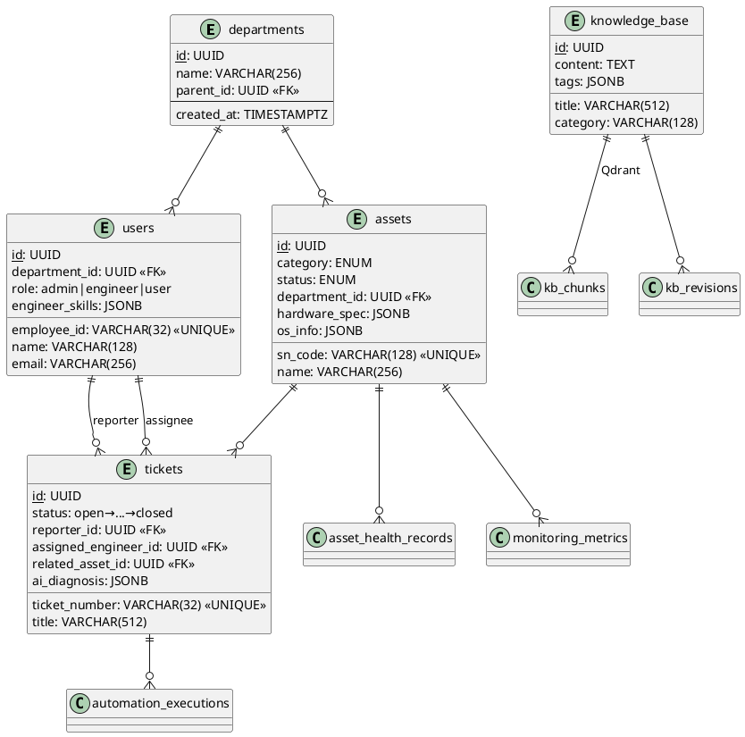

# DOC-08：IntelliServe IT Suite 数据模型规格书

> **版本**：v1.0  
> **最后更新**：2026-06-11  
> **状态**：初稿  
> **依赖**：DOC-01（系统架构规格书）  
> **参见**：[DOC-03 AI/LLM 集成设计](../architecture/DOC-03-AI-LLM集成设计.md) 第 6.1 节 — Qdrant 集合定义与索引配置

---

## 目录

1. [实体关系总览](#1-实体关系总览)
2. [核心业务实体](#2-核心业务实体)
3. [监控与指标实体](#3-监控与指标实体)
4. [知识库与向量存储](#4-知识库与向量存储)
5. [网络拓扑实体](#5-网络拓扑实体)
6. [索引策略](#6-索引策略)
7. [分区与归档策略](#7-分区与归档策略)
8. [数据库迁移规范](#8-数据库迁移规范)

---

## 1. 实体关系总览

### 1.1 ER 图（文字版）

```
                          ┌───────────────────┐
                          │   departments     │
                          │  ─────────────────│
                          │  id (PK)          │
                          │  name             │
                          │  parent_id (FK)   │
                          └────┬──────────────┘
                               │
              ┌────────────────┼────────────────┐
              │                │                │
    ┌─────────▼──────┐  ┌─────▼──────┐  ┌──────▼─────────┐
    │   assets       │  │   users    │  │   tickets       │
    │  ──────────────│  │  ──────────│  │  ───────────────│
    │  id (PK)       │  │  id (PK)   │  │  id (PK)        │
    │  sn_code       │  │  name      │  │  ticket_number  │
    │  name          │  │  email     │  │  title          │
    │  category      │  │  role      │  │  description    │
    │  status        │  │  dept(FK)  │  │  status         │
    │  dept_id (FK)  │  │  skills    │  │  reporter(FK)───┤──> users
    │  spec (JSONB)  │  └──┬─────────┘  │  assignee(FK)───┤──> users
    │  os_info(JSONB)│     │            │  asset_id (FK)  │──> assets
    └──┬─────────────┘     │            │  ai_diagnosis   │
       │                   │            │  (JSONB)        │
       │                   │            └──────┬──────────┘
       │                   │                   │
  ┌────┴─────────────┐     │    ┌──────────────┼──────────────┐
  │asset_health_     │     │    │              │              │
  │  records         │     │    │              │              │
  │ id (PK)          │     │    │              │              │
  │ asset_id (FK)────┘     │    │              │              │
  │ health_score           │    │              │              │
  │ predicted_failure      │    │              │              │
  └────────────────────────┘    │              │              │
                                │              │              │
  ┌─────────────────────────┐   │  ┌───────────▼──────┐  ┌───▼──────────────┐
  │  knowledge_base         │   │  │automation_       │  │automation_       │
  │ id (PK)                 │   │  │  scripts         │  │  executions      │
  │ title                   │   │  │ id (PK)          │  │ id (PK)          │
  │ content (Markdown)      │   │  │ name             │  │ script_id (FK)───┤
  │ category, tags          │   │  │ script_content   │  │ ticket_id (FK)───┤
  │ embedding_model         │   │  │ risk_level       │  │ target_asset(FK)─┤
  └─────────┬───────────────┘   │  │ approval_required│  │ status           │
            │                   │  └──────────────────┘  │ output_log       │
            │                   │                        └──────────────────┘
            │                   │
  ┌─────────▼───────────────┐   │  ┌──────────────────────┐
  │  Qdrant: kb_chunks      │   │  │  software_licenses   │
  │  ─────────────────────  │   │  │ id (PK)              │
  │  vector (1024-dim)      │   │  │ software_name        │
  │  payload:               │   │  │ total_seats          │
  │    kb_article_id (FK)───┘   │  │ used_seats           │
  │    chunk_index              │  │ compliance_status    │
  │    content                  │  └──────────┬───────────┘
  │    category, tags           │             │
  └─────────────────────────────┘  ┌──────────▼───────────┐
                                   │  license_assignments  │
  ┌────────────────────────────┐   │ asset_id (FK) ────────┤──> assets
  │  monitoring_metrics        │   │ license_id (FK) ──────┤──> software_licenses
  │  (TimescaleDB hypertable)  │   └──────────────────────┘
  │  time (PK, partition)      │
  │  asset_id (FK)─────────────┤──> assets
  │  metric_name               │
  │  metric_value               │
  └────────────────────────────┘

  ┌────────────────────────────┐
  │  network_devices           │
  │ id (PK)                    │
  │ name, device_type          │
  │ ip_address, mac_address    │
  └────────────┬───────────────┘
               │
  ┌────────────▼───────────────┐
  │  network_edges             │
  │ id (PK)                    │
  │ source_device_id (FK)──────┤──> network_devices
  │ target_device_id (FK)──────┤──> network_devices
  │ status                     │
  └────────────────────────────┘
```

### 1.2 实体清单

| # | 表名 | 存储引擎 | 说明 |
|---|------|---------|------|
| 1 | `departments` | PostgreSQL | 组织架构 |
| 2 | `users` | PostgreSQL | 用户/员工 |
| 3 | `assets` | PostgreSQL | IT 资产主表 |
| 4 | `asset_health_records` | PostgreSQL | 资产健康检查记录 |
| 5 | `asset_audit_logs` | PostgreSQL | 资产变更审计 |
| 6 | `asset_assignments` | PostgreSQL | 资产-用户分配关系 |
| 7 | `tickets` | PostgreSQL | 工单/服务请求 |
| 8 | `ticket_diagnoses` | PostgreSQL | 工单 AI 诊断记录 |
| 9 | `knowledge_base` | PostgreSQL | 知识库文章 |
| 10 | `kb_chunks` | Qdrant | 知识库向量块 |
| 11 | `kb_revisions` | PostgreSQL | 知识库版本历史 |
| 12 | `monitoring_metrics` | TimescaleDB (PG 超表) | 监控指标时序数据 |
| 13 | `monitoring_alerts` | PostgreSQL | 监控告警记录 |
| 14 | `network_devices` | PostgreSQL | 网络设备 |
| 15 | `network_edges` | PostgreSQL | 网络拓扑连接 |
| 16 | `network_alerts` | PostgreSQL | 网络异常告警 |
| 17 | `software_licenses` | PostgreSQL | 软件许可 |
| 18 | `license_assignments` | PostgreSQL | 许可-资产分配 |
| 19 | `automation_scripts` | PostgreSQL | 自动化脚本模板 |
| 20 | `automation_executions` | PostgreSQL | 脚本执行记录 |
| 21 | `chat_messages` | PostgreSQL | 聊天记录 |
| 22 | `llm_feedback` | PostgreSQL | LLM 回答反馈 |
| 23 | `audit_logs` | PostgreSQL | 系统审计日志 |

---

## 2. 核心业务实体

### 2.1 departments（部门）

```sql
CREATE TABLE departments (
    id          UUID PRIMARY KEY DEFAULT gen_random_uuid(),
    name        VARCHAR(256) NOT NULL,
    parent_id   UUID REFERENCES departments(id) ON DELETE SET NULL,
    manager_id  UUID,  -- FK to users.id (added later)
    created_at  TIMESTAMPTZ NOT NULL DEFAULT now(),
    updated_at  TIMESTAMPTZ NOT NULL DEFAULT now()
);

CREATE INDEX idx_departments_parent ON departments(parent_id);
```

### 2.2 users（用户）

```sql
CREATE TABLE users (
    id              UUID PRIMARY KEY DEFAULT gen_random_uuid(),
    employee_id     VARCHAR(32) UNIQUE NOT NULL,
    name            VARCHAR(128) NOT NULL,
    email           VARCHAR(256) UNIQUE,
    department_id   UUID REFERENCES departments(id) ON DELETE SET NULL,
    position        VARCHAR(128),
    
    -- IM 平台身份
    wechat_work_id  VARCHAR(128),
    dingtalk_id     VARCHAR(128),
    
    -- 认证 (FastAPI-Users)
    hashed_password VARCHAR(256),
    is_active       BOOLEAN NOT NULL DEFAULT true,
    is_verified     BOOLEAN NOT NULL DEFAULT false,
    
    -- 角色与权限
    role            VARCHAR(32) NOT NULL DEFAULT 'user'
                    CHECK (role IN ('admin', 'engineer', 'user')),
    
    -- 工程师专属
    engineer_skills JSONB DEFAULT '[]',  -- ['network','windows','printer','office']
    current_workload INTEGER DEFAULT 0,  -- 当前待处理工单数
    
    -- OAuth (Phase 3)
    oauth_provider  VARCHAR(32),
    oauth_account_id VARCHAR(256),
    
    created_at      TIMESTAMPTZ NOT NULL DEFAULT now(),
    updated_at      TIMESTAMPTZ NOT NULL DEFAULT now()
);

CREATE INDEX idx_users_department ON users(department_id);
CREATE INDEX idx_users_role ON users(role);
CREATE INDEX idx_users_wechat ON users(wechat_work_id) WHERE wechat_work_id IS NOT NULL;
CREATE INDEX idx_users_dingtalk ON users(dingtalk_id) WHERE dingtalk_id IS NOT NULL;
CREATE INDEX idx_users_engineer_skills ON users USING GIN (engineer_skills);
```

### 2.3 assets（IT 资产）

```sql
CREATE TYPE asset_category AS ENUM (
    'desktop', 'laptop', 'monitor', 'printer',
    'network', 'peripheral', 'software', 'other'
);

CREATE TYPE asset_status AS ENUM (
    'in_use', 'idle', 'maintenance', 'scrapped', 'reserved'
);

CREATE TABLE assets (
    id                  UUID PRIMARY KEY DEFAULT gen_random_uuid(),
    sn_code             VARCHAR(128) UNIQUE,
    asset_tag           VARCHAR(64) UNIQUE,       -- 企业内部资产标签
    name                VARCHAR(256) NOT NULL,
    category            asset_category NOT NULL DEFAULT 'other',
    manufacturer        VARCHAR(128),
    model               VARCHAR(256),
    department_id       UUID REFERENCES departments(id) ON DELETE SET NULL,
    location            VARCHAR(256),
    
    -- 状态
    status              asset_status NOT NULL DEFAULT 'in_use',
    
    -- 采购与财务
    purchase_date       DATE,
    purchase_cost       DECIMAL(12, 2),
    warranty_expiry     DATE,
    depreciation_years  INTEGER DEFAULT 3,
    current_value       DECIMAL(12, 2),  -- 计算字段：原值 - 折旧
    
    -- 硬件规格 (JSONB: 半结构化，不同设备类型字段不同)
    hardware_spec       JSONB DEFAULT '{}',
    -- 示例: {"cpu": "i7-12700H", "ram_gb": 32, "disk_gb": 512, "disk_type": "NVMe",
    --        "gpu_model": "RTX 3060", "screen_size": 15.6}
    
    -- 操作系统信息
    os_info             JSONB DEFAULT '{}',
    -- 示例: {"os_name": "Windows 11 Pro", "version": "23H2",
    --        "build": "22631", "install_date": "2024-03-15"}
    
    -- 在线状态
    last_seen_at        TIMESTAMPTZ,
    last_ip_address     INET,
    last_mac_address    MACADDR,
    
    -- 备注
    notes               TEXT,
    
    created_at          TIMESTAMPTZ NOT NULL DEFAULT now(),
    updated_at          TIMESTAMPTZ NOT NULL DEFAULT now()
);

-- 索引
CREATE INDEX idx_assets_sn ON assets(sn_code);
CREATE INDEX idx_assets_tag ON assets(asset_tag);
CREATE INDEX idx_assets_category ON assets(category);
CREATE INDEX idx_assets_status ON assets(status);
CREATE INDEX idx_assets_department ON assets(department_id);
CREATE INDEX idx_assets_location ON assets(location);
CREATE INDEX idx_assets_warranty ON assets(warranty_expiry);
CREATE INDEX idx_assets_last_seen ON assets(last_seen_at DESC);
CREATE INDEX idx_assets_hardware ON assets USING GIN (hardware_spec);
CREATE INDEX idx_assets_os ON assets USING GIN (os_info);

-- 闲置资产检测视图
CREATE VIEW idle_assets AS
SELECT *, 
       EXTRACT(DAY FROM (now() - last_seen_at)) AS days_since_seen
FROM assets
WHERE status = 'in_use'
  AND (last_seen_at IS NULL OR last_seen_at < now() - INTERVAL '14 days');
```

### 2.4 asset_health_records（资产健康记录）

```sql
CREATE TABLE asset_health_records (
    id                  UUID PRIMARY KEY DEFAULT gen_random_uuid(),
    asset_id            UUID NOT NULL REFERENCES assets(id) ON DELETE CASCADE,
    check_type          VARCHAR(32) NOT NULL DEFAULT 'scheduled'
                        CHECK (check_type IN ('scheduled', 'manual', 'alert_triggered')),
    
    -- 健康评分
    health_score        DECIMAL(3, 2) CHECK (health_score >= 0 AND health_score <= 1),
    
    -- 具体指标
    cpu_temp            DECIMAL(5, 2),
    disk_health         JSONB DEFAULT '{}',
    -- {"smart_status": "OK", "reallocated_sectors": 0, "power_on_hours": 8760}
    
    battery_health      DECIMAL(4, 2),  -- 笔记本电池健康度百分比
    memory_errors       INTEGER DEFAULT 0,
    
    -- AI 预测
    predicted_failure   BOOLEAN DEFAULT false,
    prediction_confidence DECIMAL(3, 2),
    prediction_model    VARCHAR(64),  -- 'threshold_rules' (Phase 2) / 'xgboost_v1' (Phase 3)
    
    -- 结果
    alert_generated     BOOLEAN DEFAULT false,
    summary             TEXT,
    
    checked_at          TIMESTAMPTZ NOT NULL DEFAULT now()
);

CREATE INDEX idx_health_asset ON asset_health_records(asset_id, checked_at DESC);
CREATE INDEX idx_health_score ON asset_health_records(asset_id, health_score);
CREATE INDEX idx_health_alert ON asset_health_records(alert_generated)
    WHERE alert_generated = true;
```

### 2.5 tickets（工单）

```sql
CREATE TYPE ticket_category AS ENUM (
    'network', 'hardware', 'software', 'peripheral', 'account', 'other'
);

CREATE TYPE ticket_priority AS ENUM (
    'low', 'medium', 'high', 'critical'
);

CREATE TYPE ticket_status AS ENUM (
    'open', 'diagnosing', 'in_progress', 'waiting_user', 'resolved', 'closed'
);

CREATE TYPE ticket_source AS ENUM (
    'chatbot', 'manual', 'monitoring_alert', 'asset_health'
);

CREATE TABLE tickets (
    id                  UUID PRIMARY KEY DEFAULT gen_random_uuid(),
    ticket_number       VARCHAR(32) UNIQUE NOT NULL,  -- TK-20260611-0001
    
    title               VARCHAR(512) NOT NULL,
    description         TEXT,
    
    category            ticket_category NOT NULL DEFAULT 'other',
    priority            ticket_priority NOT NULL DEFAULT 'medium',
    urgency             DECIMAL(3, 2),  -- AI 计算的紧急度分数
    status              ticket_status NOT NULL DEFAULT 'open',
    source              ticket_source NOT NULL DEFAULT 'manual',
    
    -- 关联
    reporter_id         UUID REFERENCES users(id),
    assigned_engineer_id UUID REFERENCES users(id),
    related_asset_id    UUID REFERENCES assets(id) ON DELETE SET NULL,
    
    -- 附件
    attachment_urls     JSONB DEFAULT '[]',  -- MinIO 对象 URL
    
    -- AI 诊断结果
    ai_diagnosis        JSONB DEFAULT '{}',
    -- {"root_cause": "...", "confidence": 0.85, "suggested_actions": [...],
    --  "recommended_script_id": "...", "similar_tickets": [...]}
    
    -- 解决信息
    resolution_summary  TEXT,
    resolution_script_id UUID REFERENCES automation_scripts(id),
    
    -- 时长统计
    time_to_first_response INTERVAL,
    time_to_resolution     INTERVAL,
    
    created_at          TIMESTAMPTZ NOT NULL DEFAULT now(),
    updated_at          TIMESTAMPTZ NOT NULL DEFAULT now(),
    resolved_at         TIMESTAMPTZ
);

-- 索引
CREATE UNIQUE INDEX idx_tickets_number ON tickets(ticket_number);
CREATE INDEX idx_tickets_status ON tickets(status);
CREATE INDEX idx_tickets_priority ON tickets(priority);
CREATE INDEX idx_tickets_category ON tickets(category);
CREATE INDEX idx_tickets_reporter ON tickets(reporter_id);
CREATE INDEX idx_tickets_assignee ON tickets(assigned_engineer_id);
CREATE INDEX idx_tickets_asset ON tickets(related_asset_id);
CREATE INDEX idx_tickets_created ON tickets(created_at DESC);
CREATE INDEX idx_tickets_unresolved ON tickets(status)
    WHERE status NOT IN ('resolved', 'closed');
```

### 2.6 knowledge_base（知识库）

```sql
CREATE TYPE kb_source_type AS ENUM (
    'manual', 'ai_generated', 'ticket_extracted'
);

CREATE TABLE knowledge_base (
    id                  UUID PRIMARY KEY DEFAULT gen_random_uuid(),
    title               VARCHAR(512) NOT NULL,
    content             TEXT NOT NULL,      -- Markdown 格式
    category            VARCHAR(128),
    tags                JSONB DEFAULT '[]',  -- ['network','dns','windows10']
    
    source_type         kb_source_type NOT NULL DEFAULT 'manual',
    source_ticket_id    UUID REFERENCES tickets(id),
    
    -- 版本
    version             INTEGER NOT NULL DEFAULT 1,
    is_published        BOOLEAN NOT NULL DEFAULT false,
    
    -- 嵌入信息
    embedding_model     VARCHAR(128),  -- 'text-embedding-v4' 或 'BAAI/bge-m3'
    chunk_count         INTEGER,
    
    -- 统计
    view_count          INTEGER DEFAULT 0,
    helpful_count       INTEGER DEFAULT 0,
    not_helpful_count   INTEGER DEFAULT 0,
    
    created_by          UUID REFERENCES users(id),
    created_at          TIMESTAMPTZ NOT NULL DEFAULT now(),
    updated_at          TIMESTAMPTZ NOT NULL DEFAULT now()
);

CREATE INDEX idx_kb_title ON knowledge_base USING GIN (to_tsvector('simple', title));
CREATE INDEX idx_kb_content ON knowledge_base USING GIN (to_tsvector('simple', content));
CREATE INDEX idx_kb_category ON knowledge_base(category);
CREATE INDEX idx_kb_tags ON knowledge_base USING GIN (tags);
CREATE INDEX idx_kb_published ON knowledge_base(is_published)
    WHERE is_published = true;
CREATE INDEX idx_kb_source ON knowledge_base(source_type);
```

### 2.7 automation_scripts（自动化脚本）

```sql
CREATE TYPE script_type AS ENUM ('powershell', 'cmd', 'python', 'bash');
CREATE TYPE script_risk AS ENUM ('low', 'medium', 'high');

CREATE TABLE automation_scripts (
    id                  UUID PRIMARY KEY DEFAULT gen_random_uuid(),
    name                VARCHAR(256) NOT NULL,
    description         TEXT,
    
    script_type         script_type NOT NULL DEFAULT 'powershell',
    script_content      TEXT NOT NULL,
    target_os           VARCHAR(32) NOT NULL DEFAULT 'windows'
                        CHECK (target_os IN ('windows', 'linux', 'macos', 'cross')),
    
    risk_level          script_risk NOT NULL DEFAULT 'low',
    approval_required   BOOLEAN NOT NULL DEFAULT false,
    
    category            VARCHAR(128),  -- 'network_reset','office_repair','cache_cleanup'
    tags                JSONB DEFAULT '[]',
    
    -- 执行约束
    timeout_seconds     INTEGER DEFAULT 300,
    max_retries         INTEGER DEFAULT 1,
    
    -- 版本管理
    version             INTEGER NOT NULL DEFAULT 1,
    is_active           BOOLEAN NOT NULL DEFAULT true,
    
    created_by          UUID REFERENCES users(id),
    created_at          TIMESTAMPTZ NOT NULL DEFAULT now(),
    updated_at          TIMESTAMPTZ NOT NULL DEFAULT now()
);

-- automation_executions（执行记录）
CREATE TABLE automation_executions (
    id                  UUID PRIMARY KEY DEFAULT gen_random_uuid(),
    script_id           UUID NOT NULL REFERENCES automation_scripts(id),
    script_version      INTEGER NOT NULL,
    ticket_id           UUID REFERENCES tickets(id),
    target_asset_id     UUID REFERENCES assets(id),
    
    executed_by         UUID REFERENCES users(id),  -- 谁触发的
    execution_mode      VARCHAR(32) NOT NULL DEFAULT 'manual'
                        CHECK (execution_mode IN ('manual', 'auto_l1', 'auto_l2', 'scheduled')),
    
    status              VARCHAR(32) NOT NULL DEFAULT 'pending'
                        CHECK (status IN ('pending', 'running', 'success', 'failed', 'cancelled', 'timeout')),
    
    started_at          TIMESTAMPTZ,
    completed_at        TIMESTAMPTZ,
    exit_code           INTEGER,
    output_log          TEXT,
    error_log           TEXT,
    
    created_at          TIMESTAMPTZ NOT NULL DEFAULT now()
);

CREATE INDEX idx_scripts_category ON automation_scripts(category);
CREATE INDEX idx_scripts_risk ON automation_scripts(risk_level);
CREATE INDEX idx_scripts_active ON automation_scripts(is_active) WHERE is_active = true;
CREATE INDEX idx_executions_ticket ON automation_executions(ticket_id);
CREATE INDEX idx_executions_asset ON automation_executions(target_asset_id);
CREATE INDEX idx_executions_status ON automation_executions(status);
```

### 2.8 software_licenses（软件许可）

```sql
CREATE TYPE license_type AS ENUM (
    'perpetual', 'subscription', 'oem', 'volume', 'free'
);

CREATE TYPE compliance_status AS ENUM (
    'compliant', 'overused', 'expiring', 'expired'
);

CREATE TABLE software_licenses (
    id                  UUID PRIMARY KEY DEFAULT gen_random_uuid(),
    software_name       VARCHAR(256) NOT NULL,
    vendor              VARCHAR(256),
    
    license_key         TEXT,  -- 生产环境加密存储 (AES-256)
    license_type        license_type NOT NULL DEFAULT 'subscription',
    
    total_seats         INTEGER NOT NULL DEFAULT 0,
    used_seats          INTEGER NOT NULL DEFAULT 0,  -- 计算字段
    
    purchase_date       DATE,
    expiry_date         DATE,
    cost_per_seat       DECIMAL(12, 2),
    renewal_cost_annual DECIMAL(12, 2),
    
    compliance_status   compliance_status NOT NULL DEFAULT 'compliant',
    
    notes               TEXT,
    created_at          TIMESTAMPTZ NOT NULL DEFAULT now(),
    updated_at          TIMESTAMPTZ NOT NULL DEFAULT now()
);

CREATE TABLE license_assignments (
    id                  UUID PRIMARY KEY DEFAULT gen_random_uuid(),
    license_id          UUID NOT NULL REFERENCES software_licenses(id) ON DELETE CASCADE,
    asset_id            UUID NOT NULL REFERENCES assets(id) ON DELETE CASCADE,
    assigned_at         TIMESTAMPTZ NOT NULL DEFAULT now(),
    UNIQUE(license_id, asset_id)
);

CREATE INDEX idx_licenses_compliance ON software_licenses(compliance_status);
CREATE INDEX idx_licenses_expiry ON software_licenses(expiry_date);
CREATE INDEX idx_license_assign_license ON license_assignments(license_id);
CREATE INDEX idx_license_assign_asset ON license_assignments(asset_id);
```

### 2.9 asset_assignments（资产-用户分配）

```sql
CREATE TABLE asset_assignments (
    id          UUID PRIMARY KEY DEFAULT gen_random_uuid(),
    asset_id    UUID NOT NULL REFERENCES assets(id) ON DELETE CASCADE,
    user_id     UUID NOT NULL REFERENCES users(id) ON DELETE CASCADE,
    assigned_by UUID REFERENCES users(id),
    assigned_at TIMESTAMPTZ NOT NULL DEFAULT now(),
    returned_at TIMESTAMPTZ,
    notes       TEXT,
    UNIQUE(asset_id, user_id, assigned_at)  -- 同一资产同一人同一时间只能分配一次
);

CREATE INDEX idx_asset_assign_asset ON asset_assignments(asset_id, returned_at);
CREATE INDEX idx_asset_assign_user ON asset_assignments(user_id, returned_at);
```

### 2.10 asset_audit_logs（资产变更审计）

```sql
CREATE TABLE asset_audit_logs (
    id          UUID PRIMARY KEY DEFAULT gen_random_uuid(),
    asset_id    UUID NOT NULL REFERENCES assets(id) ON DELETE CASCADE,
    user_id     UUID REFERENCES users(id),
    action      VARCHAR(64) NOT NULL,       -- 'created', 'updated', 'status_changed', 'assigned', 'returned', 'scanned'
    field_name  VARCHAR(128),               -- 变更字段名（如 'status', 'location', 'department_id'）
    old_value   TEXT,                       -- 变更前值
    new_value   TEXT,                       -- 变更后值
    ip_address  INET,
    user_agent  VARCHAR(512),
    created_at  TIMESTAMPTZ NOT NULL DEFAULT now()
);

CREATE INDEX idx_asset_audit_asset ON asset_audit_logs(asset_id, created_at DESC);
CREATE INDEX idx_asset_audit_user ON asset_audit_logs(user_id, created_at DESC);
```

### 2.11 ticket_diagnoses（工单 AI 诊断记录）

```sql
CREATE TABLE ticket_diagnoses (
    id              UUID PRIMARY KEY DEFAULT gen_random_uuid(),
    ticket_id       UUID NOT NULL REFERENCES tickets(id) ON DELETE CASCADE,
    
    -- AI 诊断输入
    collected_logs  JSONB DEFAULT '{}',     -- 采集的系统日志、错误码、硬件状态
    user_input      TEXT,                    -- 用户描述（输入给 LLM 的版本）
    
    -- AI 诊断输出
    model_name      VARCHAR(128),            -- 'deepseek-v4-pro'
    model_version   VARCHAR(64),             -- 'Q4_K_M'
    diagnosis_json  JSONB NOT NULL DEFAULT '{}',
    -- {"root_cause": "...", "confidence": 0.87, "suggested_actions": [...],
    --  "matched_script_id": "...", "similar_tickets": [...], "severity": "high"}
    
    confidence      DECIMAL(3, 2),
    prompt_tokens   INTEGER,
    completion_tokens INTEGER,
    latency_ms      INTEGER,
    
    -- 人工复核
    reviewed_by     UUID REFERENCES users(id),
    review_comment  TEXT,
    is_accurate     BOOLEAN,                 -- 诊断是否准确（人工标注）
    
    created_at      TIMESTAMPTZ NOT NULL DEFAULT now()
);

CREATE INDEX idx_ticket_diag_ticket ON ticket_diagnoses(ticket_id, created_at DESC);
CREATE INDEX idx_ticket_diag_accurate ON ticket_diagnoses(is_accurate) WHERE is_accurate IS NOT NULL;
```

### 2.12 chat_messages（聊天记录）

```sql
CREATE TABLE chat_messages (
    id              UUID PRIMARY KEY DEFAULT gen_random_uuid(),
    user_id         UUID REFERENCES users(id),
    platform        VARCHAR(32) NOT NULL,     -- 'wecom', 'dingtalk', 'web'
    conversation_id UUID NOT NULL,            -- 会话 ID（多轮对话分组）
    
    -- 消息内容
    role            VARCHAR(16) NOT NULL CHECK (role IN ('user', 'assistant', 'system')),
    content         TEXT NOT NULL,
    intent          VARCHAR(32),              -- AI 分类: 'greeting','knowledge_query','fault_report','service_request','feedback'
    intent_confidence DECIMAL(3, 2),
    
    -- 路由信息
    routing_tier    VARCHAR(4),               -- 'L1', 'L2', 'L3'
    related_ticket_id UUID REFERENCES tickets(id),
    related_kb_ids  JSONB DEFAULT '[]',       -- 引用的知识库文章
    executed_script_id UUID REFERENCES automation_scripts(id),
    
    -- 元数据
    raw_payload     JSONB DEFAULT '{}',       -- IM 平台原始消息
    latency_ms      INTEGER,                  -- 端到端响应延迟
    
    created_at      TIMESTAMPTZ NOT NULL DEFAULT now()
);

CREATE INDEX idx_chat_user ON chat_messages(user_id, created_at DESC);
CREATE INDEX idx_chat_conv ON chat_messages(conversation_id, created_at);
CREATE INDEX idx_chat_intent ON chat_messages(intent) WHERE intent IS NOT NULL;
CREATE INDEX idx_chat_platform ON chat_messages(platform);
```

### 2.13 llm_feedback（LLM 回答反馈）

```sql
CREATE TABLE llm_feedback (
    id                  UUID PRIMARY KEY DEFAULT gen_random_uuid(),
    chat_message_id     UUID NOT NULL REFERENCES chat_messages(id) ON DELETE CASCADE,
    user_id             UUID REFERENCES users(id),
    
    -- 评分
    rating              INTEGER CHECK (rating >= -1 AND rating <= 5),
    -- -1 = 很糟糕/有害, 0 = 未评分, 1-5 = 有用程度
    
    feedback_text       TEXT,                 -- 用户自由文本反馈
    
    -- 评估上下文
    prompt_template     VARCHAR(64),          -- 使用的 Prompt 版本
    retrieved_chunks    JSONB DEFAULT '[]',   -- RAG 检索到的知识库片段
    generated_response  TEXT,                 -- LLM 生成的回答
    response_latency_ms INTEGER,
    
    -- 系统标注
    reviewed_by         UUID REFERENCES users(id),
    review_tags         JSONB DEFAULT '[]',   -- ['hallucination', 'incomplete', 'excellent', 'outdated']
    
    created_at          TIMESTAMPTZ NOT NULL DEFAULT now()
);

CREATE INDEX idx_llm_feedback_rating ON llm_feedback(rating) WHERE rating IS NOT NULL;
CREATE INDEX idx_llm_feedback_msg ON llm_feedback(chat_message_id);
CREATE INDEX idx_llm_feedback_template ON llm_feedback(prompt_template);
```

### 2.14 network_alerts（网络异常告警）

```sql
CREATE TABLE network_alerts (
    id                  UUID PRIMARY KEY DEFAULT gen_random_uuid(),
    alert_name          VARCHAR(256) NOT NULL,
    alert_type          VARCHAR(64) NOT NULL,  -- 'bandwidth_spike', 'arp_attack', 'device_down', 'port_flapping', 'dhcp_exhaustion'
    severity            alert_severity NOT NULL DEFAULT 'warning',
    
    -- 关联
    network_device_id   UUID REFERENCES network_devices(id) ON DELETE SET NULL,
    network_edge_id     UUID REFERENCES network_edges(id) ON DELETE SET NULL,
    
    -- 告警详情
    metric_name         VARCHAR(128),
    threshold_value     DOUBLE PRECISION,
    actual_value        DOUBLE PRECISION,
    duration_seconds    INTEGER,             -- 异常持续时长
    
    message             TEXT,
    recommendation      TEXT,                 -- AI 生成的建议措施
    
    -- 处理状态
    acknowledged        BOOLEAN DEFAULT false,
    acknowledged_by     UUID REFERENCES users(id),
    related_ticket_id   UUID REFERENCES tickets(id),
    
    created_at          TIMESTAMPTZ NOT NULL DEFAULT now(),
    resolved_at         TIMESTAMPTZ
);

CREATE INDEX idx_net_alerts_device ON network_alerts(network_device_id, created_at DESC);
CREATE INDEX idx_net_alerts_type ON network_alerts(alert_type);
CREATE INDEX idx_net_alerts_unresolved ON network_alerts(resolved_at) WHERE resolved_at IS NULL;
CREATE INDEX idx_net_alerts_created ON network_alerts(created_at DESC);
```

---

## 3. 监控与指标实体

### 3.1 monitoring_metrics（TimescaleDB 超表）

```sql
-- 启用 TimescaleDB 扩展
CREATE EXTENSION IF NOT EXISTS timescaledb;

CREATE TABLE monitoring_metrics (
    time            TIMESTAMPTZ NOT NULL,
    asset_id        UUID NOT NULL REFERENCES assets(id) ON DELETE CASCADE,
    metric_name     VARCHAR(128) NOT NULL,
    metric_value    DOUBLE PRECISION NOT NULL,
    unit            VARCHAR(32),
    source          VARCHAR(64) DEFAULT 'zabbix_agent',
    
    -- 额外标签 (用于多维过滤)
    tags            JSONB DEFAULT '{}'
    -- 示例: {"disk_letter": "C:", "network_interface": "eth0"}
);

-- 转换为超表，按天分区
SELECT create_hypertable('monitoring_metrics', 'time',
    chunk_time_interval => INTERVAL '1 day');

-- 核心查询索引
CREATE INDEX idx_metrics_asset_name_time
    ON monitoring_metrics (asset_id, metric_name, time DESC);

-- 可选：压缩策略 (Phase 3，保留最近7天未压缩数据)
-- SELECT add_compression_policy('monitoring_metrics', INTERVAL '7 days');

-- 标准指标名称清单
-- 'cpu_percent'          - CPU 使用率 %
-- 'memory_percent'       - 内存使用率 %
-- 'disk_percent'         - 磁盘使用率 %
-- 'disk_read_bytes'      - 磁盘读取字节/秒
-- 'disk_write_bytes'     - 磁盘写入字节/秒
-- 'network_in_bytes'     - 网络入站字节/秒
-- 'network_out_bytes'    - 网络出站字节/秒
-- 'temperature_celsius'  - 温度 °C
-- 'battery_percent'      - 电池百分比 (笔记本)
-- 'uptime_seconds'       - 系统运行时长
```

### 3.2 monitoring_alerts（监控告警）

```sql
CREATE TYPE alert_severity AS ENUM ('info', 'warning', 'critical');

CREATE TABLE monitoring_alerts (
    id              UUID PRIMARY KEY DEFAULT gen_random_uuid(),
    asset_id        UUID NOT NULL REFERENCES assets(id) ON DELETE CASCADE,
    alert_name      VARCHAR(256) NOT NULL,
    severity        alert_severity NOT NULL DEFAULT 'warning',
    
    metric_name     VARCHAR(128),
    threshold       DOUBLE PRECISION,
    actual_value    DOUBLE PRECISION,
    
    message         TEXT,
    acknowledged    BOOLEAN DEFAULT false,
    acknowledged_by UUID REFERENCES users(id),
    ticket_id       UUID REFERENCES tickets(id),  -- 关联工单
    
    created_at      TIMESTAMPTZ NOT NULL DEFAULT now(),
    resolved_at     TIMESTAMPTZ
);

CREATE INDEX idx_alerts_asset ON monitoring_alerts(asset_id, created_at DESC);
CREATE INDEX idx_alerts_unresolved ON monitoring_alerts(resolved_at)
    WHERE resolved_at IS NULL;
```

---

## 4. 知识库与向量存储

### 4.1 Qdrant 集合：kb_chunks

```python
# Qdrant 集合定义 (通过 REST API 创建)

COLLECTION_CONFIG = {
    "vectors": {
        "size": 1024,
        "distance": "Cosine"
    },
    "hnsw_config": {
        "m": 16,
        "ef_construct": 100,
    },
    "optimizers_config": {
        "default_segment_number": 2,
    },
    "quantization_config": {
        "scalar": {
            "type": "int8",
            "quantile": 0.99,
            "always_ram": True,
        }
    },
    "on_disk_payload": True,  # Payload 存储在磁盘
}

# Payload 索引
PAYLOAD_INDEXES = [
    {"field_name": "kb_article_id", "field_type": "keyword"},
    {"field_name": "category", "field_type": "keyword"},
    {"field_name": "tags", "field_type": "keyword"},
    {"field_name": "chunk_index", "field_type": "integer"},
    {"field_name": "created_at", "field_type": "datetime"},
]
```

### 4.2 知识库版本历史

```sql
CREATE TABLE kb_revisions (
    id              UUID PRIMARY KEY DEFAULT gen_random_uuid(),
    article_id      UUID NOT NULL REFERENCES knowledge_base(id) ON DELETE CASCADE,
    version         INTEGER NOT NULL,
    title           VARCHAR(512),
    content         TEXT,
    change_summary  VARCHAR(256),
    changed_by      UUID REFERENCES users(id),
    created_at      TIMESTAMPTZ NOT NULL DEFAULT now(),
    UNIQUE(article_id, version)
);
```

---

## 5. 网络拓扑实体

### 5.1 network_devices（网络设备）

```sql
CREATE TYPE network_device_type AS ENUM (
    'router', 'switch', 'ap', 'firewall', 'server', 'other'
);

CREATE TABLE network_devices (
    id                  UUID PRIMARY KEY DEFAULT gen_random_uuid(),
    name                VARCHAR(256) NOT NULL,
    device_type         network_device_type NOT NULL DEFAULT 'other',
    
    ip_address          INET,
    mac_address         MACADDR,
    snmp_community      VARCHAR(128),  -- 生产环境加密
    snmp_version        VARCHAR(8) DEFAULT '2c',
    
    location            VARCHAR(256),
    firmware_version    VARCHAR(64),
    
    last_config_backup_at   TIMESTAMPTZ,
    config_backup_url       VARCHAR(512),  -- MinIO 对象 URL
    
    last_seen_at        TIMESTAMPTZ,
    is_online           BOOLEAN DEFAULT false,
    
    metadata            JSONB DEFAULT '{}',
    -- 示例: {"ports": 24, "vlan_count": 5, "dhcp_enabled": true}
    
    created_at          TIMESTAMPTZ NOT NULL DEFAULT now(),
    updated_at          TIMESTAMPTZ NOT NULL DEFAULT now()
);

CREATE INDEX idx_netdev_type ON network_devices(device_type);
CREATE INDEX idx_netdev_ip ON network_devices(ip_address);
CREATE INDEX idx_netdev_online ON network_devices(is_online) WHERE is_online = true;
```

### 5.2 network_edges（网络连接）

```sql
CREATE TYPE edge_status AS ENUM ('up', 'down', 'degraded');

CREATE TABLE network_edges (
    id                  UUID PRIMARY KEY DEFAULT gen_random_uuid(),
    source_device_id    UUID NOT NULL REFERENCES network_devices(id) ON DELETE CASCADE,
    target_device_id    UUID NOT NULL REFERENCES network_devices(id) ON DELETE CASCADE,
    connection_type     VARCHAR(64),  -- 'ethernet','wifi','fiber','vpn'
    bandwidth_mbps      INTEGER,
    status              edge_status NOT NULL DEFAULT 'up',
    last_checked_at     TIMESTAMPTZ,
    metadata            JSONB DEFAULT '{}',
    UNIQUE(source_device_id, target_device_id)
);

CREATE INDEX idx_edges_source ON network_edges(source_device_id);
CREATE INDEX idx_edges_target ON network_edges(target_device_id);
```

---

## 6. 索引策略

### 6.1 索引设计原则

| 原则 | 说明 |
|------|------|
| **WHERE 子句索引** | 所有频繁作为查询条件的列必须建索引 |
| **复合索引** | 多列查询按选择性从高到低排列 (asset_id, metric_name, time) |
| **部分索引** | 对满足特定条件的子集建索引 (WHERE is_active = true) |
| **GIN 索引** | JSONB 列、数组列使用 GIN 支持包含查询 (`@>` 操作符) |
| **覆盖索引** | 只读查询使用 INCLUDE 子句避免回表 |
| **避免过度索引** | 每个表索引数不超过 8 个，写入密集型表（monitoring_metrics）严格控制在 3 个以内 |

### 6.2 关键查询与索引映射

| 查询场景 | 使用索引 |
|---------|---------|
| 按 SN 码查找资产 | `idx_assets_sn` |
| 某部门所有在网资产 | `idx_assets_department` + `idx_assets_status` |
| 保修即将到期的设备 | `idx_assets_warranty` |
| 用户最近工单 | `idx_tickets_reporter` + `idx_tickets_created` |
| 某工程师待处理工单 | `idx_tickets_assignee` + `idx_tickets_unresolved` |
| 某资产历史监控数据 | `idx_metrics_asset_name_time` (覆盖索引) |
| 知识库全文搜索 | `idx_kb_title` + `idx_kb_content` (GIN tsvector) |
| 知识库按标签过滤 | `idx_kb_tags` (GIN JSONB) |

---

## 7. 分区与归档策略

### 7.1 数据分层

```
热数据 (Hot)        温数据 (Warm)         冷数据 (Cold)
─────────────       ─────────────         ─────────────
PostgreSQL 主表     TimescaleDB 压缩块     MinIO 对象存储
monitoring_metrics  monitoring_metrics    audit_logs 归档
最近 7 天            8-90 天               >90 天
无压缩               自动压缩 (10x)         JSONL 格式归档
```

### 7.2 数据保留策略

| 数据类型 | 保留期限 | 归档策略 |
|---------|---------|---------|
| monitoring_metrics (原始) | 7 天热 + 90 天温 | 超过 90 天下采样后归档至 MinIO |
| monitoring_metrics (下采样) | 1 年 | 小时级聚合保留 1 年 |
| audit_logs | 2 年 | 每年归档至 MinIO，数据库保留最近 90 天 |
| ticket 已关闭工单 | 永久 | 3 年后标记为 archived |
| asset_health_records | 1 年 | 超过 1 年的记录归档 |
| chat_messages | 90 天 | 保留用于模型评估的数据集 |
| kb_revisions | 永久 | 不限 |

### 7.3 下采样作业（Celery Beat 定时任务）

```sql
-- 每天凌晨 2:00 执行：将一天前的分钟级数据聚合为小时级
INSERT INTO monitoring_metrics_hourly (time, asset_id, metric_name, avg_value, max_value, min_value)
SELECT
    time_bucket('1 hour', time) AS hour,
    asset_id,
    metric_name,
    AVG(metric_value),
    MAX(metric_value),
    MIN(metric_value)
FROM monitoring_metrics
WHERE time >= now() - INTERVAL '25 hours'
  AND time < now() - INTERVAL '1 hour'
GROUP BY hour, asset_id, metric_name;
```

---

## 8. 数据库迁移规范

### 8.1 迁移工具与流程

- **工具**：Alembic (Python)
- **目录**：`backend/alembic/`
- **命名规范**：`YYYYMMDD_HHMM_简短描述.py`
  - 示例：`20260611_1430_add_ticket_ai_diagnosis_field.py`

### 8.2 迁移原则

1. **每个迁移只做一件事**
2. **必须包含 downgrade 逻辑**（可逆迁移）
3. **不在迁移中执行数据操作**（数据迁移使用单独的 Celery 任务）
4. **添加列使用 `nullable=True` + 默认值**，避免锁表
5. **生产环境迁移前先在 staging 验证**

### 8.3 初始迁移代码结构

```python
# alembic/versions/001_initial_schema.py

revision = '001'
down_revision = None


def upgrade():
    # ==============================
    # 1. 扩展
    # ==============================
    op.execute("CREATE EXTENSION IF NOT EXISTS timescaledb")
    op.execute("CREATE EXTENSION IF NOT EXISTS pgcrypto")     # gen_random_uuid()
    op.execute("CREATE EXTENSION IF NOT EXISTS pg_trgm")      # 模糊搜索

    # ==============================
    # 2. 枚举类型（按字母序）
    # ==============================
    op.execute("CREATE TYPE asset_category AS ENUM ('desktop', 'laptop', 'monitor', 'printer', 'network', 'peripheral', 'software', 'other')")
    op.execute("CREATE TYPE asset_status AS ENUM ('in_use', 'idle', 'maintenance', 'scrapped', 'reserved')")
    op.execute("CREATE TYPE alert_severity AS ENUM ('info', 'warning', 'critical')")
    op.execute("CREATE TYPE compliance_status AS ENUM ('compliant', 'overused', 'expiring', 'expired')")
    op.execute("CREATE TYPE edge_status AS ENUM ('up', 'down', 'degraded')")
    op.execute("CREATE TYPE kb_source_type AS ENUM ('manual', 'ai_generated', 'ticket_extracted')")
    op.execute("CREATE TYPE license_type AS ENUM ('perpetual', 'subscription', 'oem', 'volume', 'free')")
    op.execute("CREATE TYPE network_device_type AS ENUM ('router', 'switch', 'ap', 'firewall', 'server', 'other')")
    op.execute("CREATE TYPE script_risk AS ENUM ('low', 'medium', 'high')")
    op.execute("CREATE TYPE script_type AS ENUM ('powershell', 'cmd', 'python', 'bash')")
    op.execute("CREATE TYPE ticket_category AS ENUM ('network', 'hardware', 'software', 'peripheral', 'account', 'other')")
    op.execute("CREATE TYPE ticket_priority AS ENUM ('low', 'medium', 'high', 'critical')")
    op.execute("CREATE TYPE ticket_source AS ENUM ('chatbot', 'manual', 'monitoring_alert', 'asset_health')")
    op.execute("CREATE TYPE ticket_status AS ENUM ('open', 'diagnosing', 'in_progress', 'waiting_user', 'resolved', 'closed')")

    # ==============================
    # 3. 基础表 (按依赖顺序：无 FK → 有 FK)
    # ==============================
    # 3.1 departments（无外键）
    op.execute("""
        CREATE TABLE departments (
            id UUID PRIMARY KEY DEFAULT gen_random_uuid(),
            name VARCHAR(256) NOT NULL,
            parent_id UUID REFERENCES departments(id) ON DELETE SET NULL,
            manager_id UUID,
            created_at TIMESTAMPTZ NOT NULL DEFAULT now(),
            updated_at TIMESTAMPTZ NOT NULL DEFAULT now()
        )
    """)

    # 3.2 users（依赖 departments）
    op.execute("""
        CREATE TABLE users (
            id UUID PRIMARY KEY DEFAULT gen_random_uuid(),
            employee_id VARCHAR(32) UNIQUE NOT NULL,
            name VARCHAR(128) NOT NULL,
            email VARCHAR(256) UNIQUE,
            department_id UUID REFERENCES departments(id) ON DELETE SET NULL,
            position VARCHAR(128),
            wechat_work_id VARCHAR(128),
            dingtalk_id VARCHAR(128),
            hashed_password VARCHAR(256),
            is_active BOOLEAN NOT NULL DEFAULT true,
            is_verified BOOLEAN NOT NULL DEFAULT false,
            role VARCHAR(32) NOT NULL DEFAULT 'user'
                CHECK (role IN ('admin', 'engineer', 'user')),
            engineer_skills JSONB DEFAULT '[]',
            current_workload INTEGER DEFAULT 0,
            oauth_provider VARCHAR(32),
            oauth_account_id VARCHAR(256),
            created_at TIMESTAMPTZ NOT NULL DEFAULT now(),
            updated_at TIMESTAMPTZ NOT NULL DEFAULT now()
        )
    """)

    # 3.3 assets（依赖 departments）
    op.execute("""
        CREATE TABLE assets (
            id UUID PRIMARY KEY DEFAULT gen_random_uuid(),
            sn_code VARCHAR(128) UNIQUE,
            asset_tag VARCHAR(64) UNIQUE,
            name VARCHAR(256) NOT NULL,
            category asset_category NOT NULL DEFAULT 'other',
            manufacturer VARCHAR(128),
            model VARCHAR(256),
            department_id UUID REFERENCES departments(id) ON DELETE SET NULL,
            location VARCHAR(256),
            status asset_status NOT NULL DEFAULT 'in_use',
            purchase_date DATE,
            purchase_cost DECIMAL(12, 2),
            warranty_expiry DATE,
            depreciation_years INTEGER DEFAULT 3,
            current_value DECIMAL(12, 2),
            hardware_spec JSONB DEFAULT '{}',
            os_info JSONB DEFAULT '{}',
            last_seen_at TIMESTAMPTZ,
            last_ip_address INET,
            last_mac_address MACADDR,
            notes TEXT,
            created_at TIMESTAMPTZ NOT NULL DEFAULT now(),
            updated_at TIMESTAMPTZ NOT NULL DEFAULT now()
        )
    """)

    # 3.4 automation_scripts（依赖 users）
    # 3.5 tickets（依赖 users, assets, automation_scripts）
    # 3.6 knowledge_base（依赖 users, tickets）
    # 3.7 software_licenses
    # 3.8 network_devices
    # ...（其余表按依赖顺序创建）

    # ==============================
    # 4. 关联表（多对多）
    # ==============================
    # asset_assignments, license_assignments, network_edges

    # ==============================
    # 5. 子表（一对多，依赖主表）
    # ==============================
    # asset_health_records, asset_audit_logs, ticket_diagnoses,
    # automation_executions, kb_revisions, chat_messages, llm_feedback,
    # monitoring_alerts, network_alerts

    # ==============================
    # 6. TimescaleDB 超表
    # ==============================
    op.execute("""
        CREATE TABLE monitoring_metrics (
            time TIMESTAMPTZ NOT NULL,
            asset_id UUID NOT NULL REFERENCES assets(id) ON DELETE CASCADE,
            metric_name VARCHAR(128) NOT NULL,
            metric_value DOUBLE PRECISION NOT NULL,
            unit VARCHAR(32),
            source VARCHAR(64) DEFAULT 'zabbix_agent',
            tags JSONB DEFAULT '{}'
        )
    """)
    op.execute("SELECT create_hypertable('monitoring_metrics', 'time', chunk_time_interval => INTERVAL '1 day')")

    # ==============================
    # 7. 索引（按表分组，先高频后低频）
    # ==============================
    # departments
    op.execute("CREATE INDEX idx_departments_parent ON departments(parent_id)")

    # users
    op.execute("CREATE INDEX idx_users_department ON users(department_id)")
    op.execute("CREATE INDEX idx_users_role ON users(role)")
    op.execute("CREATE INDEX idx_users_wechat ON users(wechat_work_id) WHERE wechat_work_id IS NOT NULL")
    op.execute("CREATE INDEX idx_users_dingtalk ON users(dingtalk_id) WHERE dingtalk_id IS NOT NULL")
    op.execute("CREATE INDEX idx_users_engineer_skills ON users USING GIN (engineer_skills)")

    # assets
    op.execute("CREATE INDEX idx_assets_sn ON assets(sn_code)")
    op.execute("CREATE INDEX idx_assets_tag ON assets(asset_tag)")
    op.execute("CREATE INDEX idx_assets_category ON assets(category)")
    op.execute("CREATE INDEX idx_assets_status ON assets(status)")
    op.execute("CREATE INDEX idx_assets_department ON assets(department_id)")
    op.execute("CREATE INDEX idx_assets_warranty ON assets(warranty_expiry)")
    op.execute("CREATE INDEX idx_assets_last_seen ON assets(last_seen_at DESC)")
    op.execute("CREATE INDEX idx_assets_hardware ON assets USING GIN (hardware_spec)")
    op.execute("CREATE INDEX idx_assets_os ON assets USING GIN (os_info)")

    # tickets
    op.execute("CREATE UNIQUE INDEX idx_tickets_number ON tickets(ticket_number)")
    op.execute("CREATE INDEX idx_tickets_status ON tickets(status)")
    op.execute("CREATE INDEX idx_tickets_reporter ON tickets(reporter_id)")
    op.execute("CREATE INDEX idx_tickets_assignee ON tickets(assigned_engineer_id)")
    op.execute("CREATE INDEX idx_tickets_asset ON tickets(related_asset_id)")
    op.execute("CREATE INDEX idx_tickets_created ON tickets(created_at DESC)")
    op.execute("CREATE INDEX idx_tickets_unresolved ON tickets(status) WHERE status NOT IN ('resolved', 'closed')")

    # monitoring_metrics (TimescaleDB 超表)
    op.execute("CREATE INDEX idx_metrics_asset_name_time ON monitoring_metrics (asset_id, metric_name, time DESC)")

    # knowledge_base 全文搜索
    op.execute("CREATE INDEX idx_kb_title ON knowledge_base USING GIN (to_tsvector('simple', title))")
    op.execute("CREATE INDEX idx_kb_content ON knowledge_base USING GIN (to_tsvector('simple', content))")
    op.execute("CREATE INDEX idx_kb_published ON knowledge_base(is_published) WHERE is_published = true")

    # ==============================
    # 8. 审计日志表
    # ==============================
    op.execute("""
        CREATE TABLE audit_logs (
            id UUID PRIMARY KEY DEFAULT gen_random_uuid(),
            user_id UUID REFERENCES users(id),
            username VARCHAR(128),
            user_role VARCHAR(32),
            source_ip INET NOT NULL,
            action VARCHAR(64) NOT NULL,
            resource_type VARCHAR(64) NOT NULL,
            resource_id UUID,
            resource_detail JSONB DEFAULT '{}',
            status VARCHAR(16) NOT NULL DEFAULT 'success',
            error_message TEXT,
            user_agent VARCHAR(512),
            request_id UUID,
            duration_ms INTEGER,
            created_at TIMESTAMPTZ NOT NULL DEFAULT now()
        )
    """)
    op.execute("CREATE INDEX idx_audit_user ON audit_logs(user_id, created_at DESC)")
    op.execute("CREATE INDEX idx_audit_action ON audit_logs(action, resource_type)")
    op.execute("CREATE INDEX idx_audit_time ON audit_logs(created_at DESC)")

    # ==============================
    # 9. 视图
    # ==============================
    op.execute("""
        CREATE VIEW idle_assets AS
        SELECT *, EXTRACT(DAY FROM (now() - last_seen_at)) AS days_since_seen
        FROM assets
        WHERE status = 'in_use'
          AND (last_seen_at IS NULL OR last_seen_at < now() - INTERVAL '14 days')
    """)


def downgrade():
    """按逆序删除所有对象"""
    # 9. 视图
    op.execute("DROP VIEW IF EXISTS idle_assets")

    # 8. 审计日志
    op.execute("DROP TABLE IF EXISTS audit_logs CASCADE")

    # 7. 索引 (随表一起删除，此处显式列出以防回退中间迁移)
    # 6. 超表
    op.execute("DROP TABLE IF EXISTS monitoring_metrics CASCADE")

    # 5. 子表
    op.execute("DROP TABLE IF EXISTS network_alerts CASCADE")
    op.execute("DROP TABLE IF EXISTS monitoring_alerts CASCADE")
    op.execute("DROP TABLE IF EXISTS llm_feedback CASCADE")
    op.execute("DROP TABLE IF EXISTS chat_messages CASCADE")
    op.execute("DROP TABLE IF EXISTS kb_revisions CASCADE")
    op.execute("DROP TABLE IF EXISTS automation_executions CASCADE")
    op.execute("DROP TABLE IF EXISTS ticket_diagnoses CASCADE")
    op.execute("DROP TABLE IF EXISTS asset_audit_logs CASCADE")
    op.execute("DROP TABLE IF EXISTS asset_health_records CASCADE")

    # 4. 关联表
    op.execute("DROP TABLE IF EXISTS network_edges CASCADE")
    op.execute("DROP TABLE IF EXISTS license_assignments CASCADE")
    op.execute("DROP TABLE IF EXISTS asset_assignments CASCADE")

    # 3. 主表
    op.execute("DROP TABLE IF EXISTS network_devices CASCADE")
    op.execute("DROP TABLE IF EXISTS software_licenses CASCADE")
    op.execute("DROP TABLE IF EXISTS knowledge_base CASCADE")
    op.execute("DROP TABLE IF EXISTS tickets CASCADE")
    op.execute("DROP TABLE IF EXISTS automation_scripts CASCADE")
    op.execute("DROP TABLE IF EXISTS assets CASCADE")
    op.execute("DROP TABLE IF EXISTS users CASCADE")
    op.execute("DROP TABLE IF EXISTS departments CASCADE")

    # 2. 枚举类型 (逆序)
    op.execute("DROP TYPE IF EXISTS ticket_status")
    op.execute("DROP TYPE IF EXISTS ticket_source")
    op.execute("DROP TYPE IF EXISTS ticket_priority")
    op.execute("DROP TYPE IF EXISTS ticket_category")
    op.execute("DROP TYPE IF EXISTS script_type")
    op.execute("DROP TYPE IF EXISTS script_risk")
    op.execute("DROP TYPE IF EXISTS network_device_type")
    op.execute("DROP TYPE IF EXISTS license_type")
    op.execute("DROP TYPE IF EXISTS kb_source_type")
    op.execute("DROP TYPE IF EXISTS edge_status")
    op.execute("DROP TYPE IF EXISTS compliance_status")
    op.execute("DROP TYPE IF EXISTS alert_severity")
    op.execute("DROP TYPE IF EXISTS asset_status")
    op.execute("DROP TYPE IF EXISTS asset_category")

    # 1. 扩展
    op.execute("DROP EXTENSION IF EXISTS pg_trgm")
    op.execute("DROP EXTENSION IF EXISTS pgcrypto")
    op.execute("DROP EXTENSION IF EXISTS timescaledb")
```

---

## 附录 A：数据库连接配置

```python
# backend/api/core/database.py

from sqlalchemy.ext.asyncio import create_async_engine, async_sessionmaker
from api.core.config import settings

DATABASE_URL = (
    f"postgresql+asyncpg://"
    f"{settings.DB_USER}:{settings.DB_PASSWORD}@"
    f"{settings.DB_HOST}:{settings.DB_PORT}/"
    f"{settings.DB_NAME}"
)

engine = create_async_engine(
    DATABASE_URL,
    echo=settings.DB_ECHO,
    pool_size=settings.DB_POOL_SIZE,          # 默认 20
    max_overflow=settings.DB_MAX_OVERFLOW,     # 默认 10
    pool_pre_ping=True,
)

AsyncSessionLocal = async_sessionmaker(
    engine,
    expire_on_commit=False,
)
```

## 附录 B：Entity-Relationship Diagram (PlantUML)



---

## 附录 C：资产成本、IPAM、软件库与外设扩展模型

### C.1 `asset_cost_snapshots` 资产成本快照

用于按月固化折旧、净值和维修成本，避免历史报表随规则变化漂移。

| 字段 | 类型 | 说明 |
|------|------|------|
| `id` | UUID PK | 主键 |
| `asset_id` | UUID FK | 关联资产 |
| `snapshot_month` | DATE | 快照月份，取每月 1 日 |
| `purchase_cost` | NUMERIC(12,2) | 购入金额 |
| `depreciation_method` | VARCHAR(32) | 折旧方法 |
| `depreciation_months` | INT | 折旧周期 |
| `salvage_rate` | NUMERIC(5,4) | 残值率 |
| `book_value` | NUMERIC(12,2) | 账面净值 |
| `market_residual_value` | NUMERIC(12,2) | 估算残值 |
| `repair_cost_total` | NUMERIC(12,2) | 累计维修成本 |
| `recommendation` | VARCHAR(32) | retain/transfer/repair/refresh/scrap |
| `created_at` | TIMESTAMPTZ | 生成时间 |

### C.2 `asset_network_bindings` MAC/IP 绑定历史

| 字段 | 类型 | 说明 |
|------|------|------|
| `id` | UUID PK | 主键 |
| `asset_id` | UUID FK | 关联资产 |
| `interface_name` | VARCHAR(128) | 网卡名称 |
| `mac_address` | MACADDR | MAC 地址 |
| `ip_address` | INET | IP 地址 |
| `vlan_id` | INT | VLAN |
| `source` | VARCHAR(32) | agent/dhcp/arp/manual |
| `is_primary` | BOOLEAN | 是否主绑定 |
| `first_seen_at` | TIMESTAMPTZ | 首次发现 |
| `last_seen_at` | TIMESTAMPTZ | 最近发现 |

### C.3 `ip_pools` 与 `ip_allocations`

`ip_pools` 管理地址池：

| 字段 | 类型 | 说明 |
|------|------|------|
| `id` | UUID PK | 主键 |
| `name` | VARCHAR(128) | 地址池名称 |
| `cidr` | CIDR | 网段 |
| `vlan_id` | INT | VLAN |
| `gateway` | INET | 网关 |
| `dns_servers` | JSONB | DNS 列表 |
| `purpose` | VARCHAR(128) | 用途 |
| `owner_department_id` | UUID FK | 负责人部门 |

`ip_allocations` 管理具体地址：

| 字段 | 类型 | 说明 |
|------|------|------|
| `id` | UUID PK | 主键 |
| `pool_id` | UUID FK | 地址池 |
| `ip_address` | INET | IP 地址 |
| `status` | VARCHAR(32) | free/allocated/reserved/conflict/deprecated |
| `asset_id` | UUID FK NULL | 绑定资产 |
| `mac_address` | MACADDR NULL | 绑定 MAC |
| `assigned_user_id` | UUID FK NULL | 使用人 |
| `reserved_reason` | VARCHAR(256) | 保留原因 |
| `last_seen_at` | TIMESTAMPTZ | 最近发现 |

### C.4 软件库与安装记录

`software_catalog`：

| 字段 | 类型 | 说明 |
|------|------|------|
| `id` | UUID PK | 主键 |
| `name` | VARCHAR(256) | 软件名称 |
| `vendor` | VARCHAR(128) | 厂商 |
| `category` | VARCHAR(64) | office/design/dev/security/driver |
| `standard_level` | VARCHAR(32) | required/optional/controlled/blocked |
| `license_policy` | VARCHAR(32) | per_user/per_device/concurrent/free |
| `silent_install_args` | TEXT | 静默安装参数 |
| `silent_uninstall_args` | TEXT | 静默卸载参数 |
| `package_url` | TEXT | 安装包地址 |
| `package_hash` | VARCHAR(128) | 包哈希 |

`software_installations`：

| 字段 | 类型 | 说明 |
|------|------|------|
| `id` | UUID PK | 主键 |
| `asset_id` | UUID FK | 资产 |
| `software_id` | UUID FK NULL | 软件库条目 |
| `display_name` | VARCHAR(256) | Agent 采集名称 |
| `version` | VARCHAR(64) | 版本 |
| `publisher` | VARCHAR(128) | 发布者 |
| `install_date` | DATE | 安装日期 |
| `last_used_at` | TIMESTAMPTZ | 最近使用 |
| `compliance_status` | VARCHAR(32) | compliant/unauthorized/overused/blocked |

### C.5 打印机与驱动库

`printers`：

| 字段 | 类型 | 说明 |
|------|------|------|
| `id` | UUID PK | 主键 |
| `asset_id` | UUID FK NULL | 关联资产 |
| `name` | VARCHAR(128) | 打印机名称 |
| `model` | VARCHAR(128) | 型号 |
| `ip_address` | INET | IP |
| `mac_address` | MACADDR | MAC |
| `location` | VARCHAR(256) | 位置 |
| `department_id` | UUID FK | 部门 |
| `driver_id` | UUID FK NULL | 推荐驱动 |
| `queue_status` | VARCHAR(32) | ready/offline/error |

`printer_drivers`：

| 字段 | 类型 | 说明 |
|------|------|------|
| `id` | UUID PK | 主键 |
| `vendor` | VARCHAR(128) | 厂商 |
| `model_pattern` | VARCHAR(256) | 适配型号表达式 |
| `os_family` | VARCHAR(64) | Windows/macOS/Linux |
| `os_version` | VARCHAR(64) | 适配版本 |
| `driver_version` | VARCHAR(64) | 驱动版本 |
| `package_url` | TEXT | 包地址 |
| `install_command` | TEXT | 静默安装命令 |
| `repair_script_id` | UUID FK NULL | 修复脚本 |

### C.6 自动盘点、差异与报废审批

`asset_audit_runs` 记录盘点任务，`asset_audit_differences` 记录差异：

| 差异类型 | 说明 |
|----------|------|
| `missing_in_network` | 台账有资产，但网络/Agent 未发现 |
| `unknown_in_network` | 网络发现设备，但台账不存在 |
| `ip_mismatch` | 当前 IP 与台账不一致 |
| `mac_mismatch` | 当前 MAC 与台账不一致 |
| `owner_mismatch` | 登录使用人与台账使用人不一致 |
| `software_violation` | 软件安装与授权策略不一致 |

`asset_disposal_requests` 用于报废/换新审批：

| 字段 | 类型 | 说明 |
|------|------|------|
| `id` | UUID PK | 主键 |
| `asset_id` | UUID FK | 资产 |
| `request_type` | VARCHAR(32) | scrap/refresh |
| `reason` | TEXT | 原因 |
| `book_value` | NUMERIC(12,2) | 账面净值 |
| `repair_cost_total` | NUMERIC(12,2) | 累计维修 |
| `ai_recommendation` | JSONB | AI 建议与依据 |
| `approval_status` | VARCHAR(32) | pending/approved/rejected |
